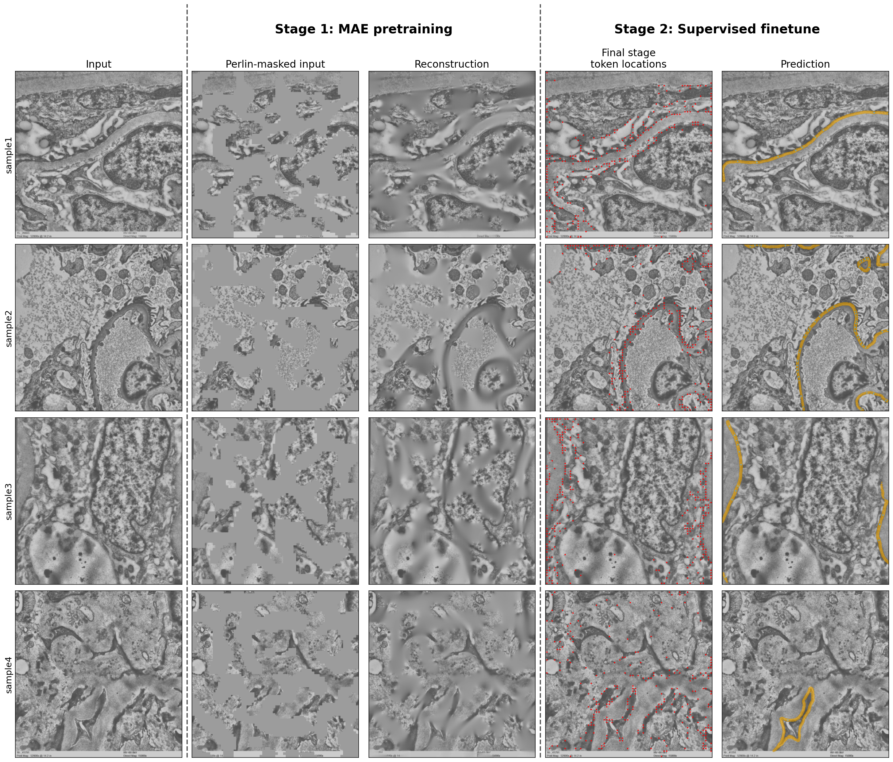

<div align="center">

# AFFMAE: AutoFocusFormer Masked Autoencoder [ECCV 2026]

[](https://arxiv.org/abs/2602.16249)
[](https://huggingface.co/spaces/smerkd/affmae)
[](https://huggingface.co/smerkd/affmae)

</div>

This is the official public repository for AFFMAE a hierarchical high-resolution efficient SSL method that
enables visual pre-training on desktop class hardware. Unlike grid-based attention and downsampling approaches (ex: Swin),
AFF operates on balanced space-filling curve optimized KNN attention, affording MiM modeling. We adapt AFF with
efficient triton kernels and an adapted point-based multi-scale deformable decoder to support masked auto-encoding. This
enables a fully end-to-end learning of an efficient hierarchichal ViT that learns where to merge tokens and focus compute around
informative structures giving you non-uniform / informative token locations and features. The pretrained point-based decoder
can easily be repurposed and finetuned for downstream tasks, such as segmentation.




## Quick Start

You can try out the model with ZeroGPU on HuggingFace
[here](https://huggingface.co/spaces/smerkd/affmae).

### Installation

Using mamba/conda
```bash
mamba env create -f environment.yml
mamba activate affmae
pytest -q   # optional: run tests
```

Using pip
```bash
pip install -e ".[all]"               # everything
```

> On a CPU-only or Apple-silicon host, drop `cuda` from the extras in
`environment.yml`.

### Inference

```bash
# AFFMAE_BASE_FT_512 is downloaded on first use and carries its own config.
# `--list-weights` shows the other released checkpoints.
python inference.py --checkpoint AFFMAE_BASE_FT_512 --image docs/assets/sample1.png
```

Point `--checkpoint` at a `.pth` of your own instead, with the `--config` it was
trained with, once you have finetuned. Or from Python:

```python
from affmae import AFFMAE
from affmae.data.weights import EMWeights

# A registry entry carries its own config, resolution and is
# downloaded once into weights/segmentation/ automatically
model = AFFMAE.from_checkpoint(EMWeights.AFFMAE_BASE_FT_512)

# run through model
result = model.segment("docs/assets/sample1.png")

# prediction results
result.labels                                    # [H, W] class indices, 0 = background
result.save_overlay("output/overlay.png")        # prediction drawn over the input

# encoder features and token locations
result.stage_names                               # ['res2', 'res3', 'res4', 'res5']
result.locations                                 # [[4096,2], [1638,2], [655,2], [262,2]]
result.features                                  # [[4096,128], ..., [262,768]]
locations, features = result.stage("res5")       # by name, or result.stage(-1)

result.render_locations("output/tokens.png")            # every stage side by side
result.render_locations("output/tokens_res5.png", -1)    # just the final stage
```

Reconstruction works the same way from a pretraining checkpoint, and its
`locations`/`features` are on the visible tokens only.

```python
mae = AFFMAE.from_checkpoint(EMWeights.AFFMAE_BASE_PRETRAIN_512)
recon = mae.reconstruct("docs/assets/sample1.png", mask_ratio=0.5)

recon.masked                                     # input with the Perlin mask applied
recon.reconstructions[-1]                        # visible patches kept, masked region predicted
recon.save("output/reconstruction.png")          # original | masked | per-stage | residual
```

For a checkpoint of your own, give the path and the config it was trained with:

```python
model = AFFMAE.from_checkpoint(
    "output/my_finetune/last_model.pth",
    config="configs/my_finetune.yaml",
    mode="inference",
    cluster_attention_backend="auto",
    decoder_deform_backend="auto",
)
```

> **Note:** `mode="inference"` removes cached tensors constructed on forward pass used by backward. This speeds up inference, but breaks backward pass. Use `mode="finetune"` when gradients are required.

See the [training guide](docs/train.md) and
[evaluation guide](docs/eval.md) for complete examples.

## Pretrained Weights

To use our pretrained weights, pass an `EMWeights` member to `from_checkpoint`. It downloads the file on first use into
`weights/{pretrain,segmentation}`; set `CHECKPOINT_ROOT` to cache elsewhere.

All of them also sit in one [public Drive folder](https://drive.google.com/drive/folders/1ZGnBMpduV43wgiTVMJCyBSYUiMRtM_NW) if you would rather download by hand.

| Model | Backbone | Stage | Resolution | Download |
|---|---|---|---|---|
| `AFFMAE_BASE_PRETRAIN_512` | AFF-MAE Base | pretrain | 512 | [weights.pth](https://drive.google.com/file/d/1-2dkpOv4Q6f3jrX3Lom02wnCMasq9TbS/view) |
| `AFFMAE_BASE_FT_512` | AFF-MAE Base | segmentation | 512 | [weights.pth](https://drive.google.com/file/d/13TcyZG9Gd-0vxkAFXpe0oRtaAvVsWXTq/view) |
| `AFFMAE_BASE_FT_768` | AFF-MAE Base | segmentation | 768 | [weights.pth](https://drive.google.com/file/d/17YqfGYbXduXgAC14frn9gNCuMJ7-653Y/view) |
| `AFFMAE_BASE_FT_1024` | AFF-MAE Base | segmentation | 1024 | [weights.pth](https://drive.google.com/file/d/1YDlfN1Gm5qBv8WhIdrL9ujeQamDqXUS_/view) |
| `VIT_BASE_PRETRAIN_512` | ViT-Base | pretrain | 512 | [weights.pth](https://drive.google.com/file/d/1ZYsiE_GxBDmunx0VCGhfOh4bP9fwWKhg/view) |
| `VIT_BASE_FT_512` | ViT-Base + UperNet | segmentation | 512 | [weights.pth](https://drive.google.com/file/d/1A7spm6E7Rbq56LNzlgdUCuIhPN4-bT7-/view) |
| `VIT_BASE_FT_768` | ViT-Base + UperNet | segmentation | 768 | [weights.pth](https://drive.google.com/file/d/1zPbites1OuYJsXEYzKkElmXsBxMUaFi3/view) |
| `VIT_BASE_FT_1024` | ViT-Base + UperNet | segmentation | 1024 | [weights.pth](https://drive.google.com/file/d/1R3lj9kBFl0jAd_O1H9mwaGpik2vgo-_-/view) |


## Interactive FPW Demo

Hosted on [HuggingFace](https://huggingface.co/spaces/smerkd/affmae), or run it
yourself:

```bash
pip install -e ".[demo,inference,viz]"
python inference.py --checkpoint AFFMAE_BASE_FT_512 --gradio \
  --pretrain-checkpoint AFFMAE_BASE_PRETRAIN_512
```

The demo provides segmentation, reconstruction (with a pretraining checkpoint),
adaptive token locations, and batch inference through the same preprocessing and
model API as the CLI.


## Training and Evaluation

```bash
# self-supervised pretraining
python pretrain.py \
  --config configs/aff_base_pretrain_0.4ds_0.5mask_last_local.yaml

# FPW fine-tuning
python finetune.py --config configs/aff_base_finetune_512_fpw.yaml

# segmentation and FPW evaluation
python evaluate.py --config configs/aff_base_finetune_512_fpw.yaml
python evaluate.py --config configs/aff_base_finetune_512_fpw.yaml --mode fpw
```

### Data layout

Every config reads paths relative to two variables, `DATA_ROOT` (default `data`)
and `CHECKPOINT_ROOT` (default `weights`), resolved against the repository root
rather than your shell's working directory. So the expected tree is:

```
data/
  pretrain/                  # stage 1: WebDataset .tar shards, images only
    customdata-000.tar ... customdata-031.tar
  finetune/                  # stage 2: supervised splits
    train/  images/  masks/
    val/    images/  masks/
    test/   images/  masks/
```

`data/` can be a symlink, or you can leave the repository untouched and point the
variable at your storage:

```bash
export DATA_ROOT=/mnt/datasets        # or: ln -s /mnt/datasets data
export CHECKPOINT_ROOT=/mnt/weights
```

**Pretraining** consumes WebDataset shards: uncompressed `.tar` files of `.png`
images with no labels, keyed by basename. Because a WebDataset has no length, the
epoch boundary comes from `data.total_samples` in the config, so set it to your
image count.

**Finetuning** consumes image/mask directories. Images and masks pair up by
filename stem (`img_0001.tif` ↔ `img_0001.tiff`), and masks are multi-channel
TIFFs with one binary channel per annotated structure — `data.indices` selects
which channels to train on.

### Training on your own data

Two template configs are provided:

```bash
cp configs/template_pretrain_512.yaml configs/my_pretrain.yaml
python pretrain.py --config configs/my_pretrain.yaml

cp configs/template_finetune_512.yaml configs/my_finetune.yaml
python finetune.py --config configs/my_finetune.yaml
```

See **[docs/custom_data.md](docs/custom_data.md)**
for how to build the shards and the mask format details.


## Hardware and Kernel Coverage

| Device | Automatic path | Status |
|---|---|---|
| NVIDIA CUDA | fused Triton cluster and decoder kernels | optimized and tested |
| AMD HIP | Triton/HIP where supported, otherwise PyTorch | expected to work; untested |
| CPU | PyTorch operators; PyKeOps may accelerate supported KNN calls | inference tested |
| Apple MPS | PyTorch operators and PyTorch KNN | expected to work; untested |

## Limitations

The kernels developed depend on PyKeops which is designed for CUDA which is very efficient. HIP/CPU/others use
a pytorch KNN variant which is much slower. This is on our TODO to make it faster with other cards. Additionally,
the hyperparameters we found are tuned for our dataset. For example, when training the the typical ViT-MAE we found 50% masking works better for EM images than the typical 75%+ masking. Additionally, we have not done testing on very dense prediction tasks and our
data focuses on long thin and small structures. So performance with dense segmentation has not been evaluated with this model.

## Acknowledgements

Built on [AutoFocusFormer](https://github.com/apple/ml-autofocusformer). The MAE
setup follows [MAE](https://github.com/facebookresearch/mae), ViT
reference blocks come from [timm](https://github.com/huggingface/pytorch-image-models),
and fused kernels are implemented with [Triton](https://github.com/triton-lang/triton).

We'd also like to thank Dr. Mauer for contributing much of the pretraining data needed for this project.

## Citation

```bibtex
@misc{2026affmae,
      title={AFFMAE: Scalable Vision Pre-Training for High-Resolution Microscopy Segmentation on Desktop Hardware},
      author={David Smerkous and Zian Wang and Behzad Najafian},
      year={2026},
      eprint={2602.16249},
      archivePrefix={arXiv},
      primaryClass={cs.CV},
      url={https://arxiv.org/abs/2602.16249},
}
```
